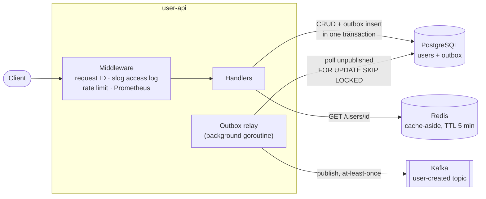

# User API

REST API for user management built with Go. Demonstrates a typical microservice architecture: PostgreSQL for persistence, Redis for caching, Kafka events delivered reliably through a transactional outbox.

## Architecture



Creating a user writes the row **and** its event into an `outbox` table in a single transaction. A background relay polls the outbox and publishes pending events to Kafka, so events are never lost when the broker is down and never emitted for a rolled-back insert (no dual-write problem).

## Stack

| Layer | Technology |
|---|---|
| Language | Go |
| Router | [chi v5](https://github.com/go-chi/chi) |
| Database | PostgreSQL + [pgx](https://github.com/jackc/pgx) driver |
| Cache | Redis ([go-redis/v9](https://github.com/redis/go-redis)) |
| Broker | Kafka ([segmentio/kafka-go](https://github.com/segmentio/kafka-go)) via transactional outbox |
| Migrations | [goose](https://github.com/pressly/goose) |
| Config | env vars + [godotenv](https://github.com/joho/godotenv) |
| Logging | log/slog (JSON), structured access logs with request IDs |
| Metrics | Prometheus ([client_golang](https://github.com/prometheus/client_golang)), `/metrics` |
| Rate limiting | per-IP token bucket ([x/time/rate](https://pkg.go.dev/golang.org/x/time/rate)) |
| Container | Docker (multi-stage build, non-root) |
| CI | GitHub Actions (build, vet, gofmt, test -race, golangci-lint) |

## Project structure

```
user-api/
├── cmd/
│   ├── main.go          # entry point, wiring, graceful shutdown
│   └── loadtest/        # standalone HTTP load generator
├── internal/
│   ├── handler/         # HTTP handlers, UserStorage interface, health checks
│   ├── middleware/      # per-IP rate limiting, slog request logging
│   ├── metrics/         # Prometheus instrumentation
│   ├── outbox/          # outbox relay (poll → publish → mark)
│   ├── db/              # PostgreSQL implementation, outbox storage, pool
│   ├── cache/           # Redis cache (cache-aside, miss vs error)
│   ├── broker/          # Kafka producer
│   ├── config/          # typed config, fail-fast env validation
│   └── model/           # User struct
├── migrations/          # goose SQL migrations
├── .github/workflows/   # CI pipeline
├── Dockerfile
├── docker-compose.yml
├── Makefile
├── .env.example
└── .env.docker.example
```

## Configuration

All configuration is read from environment variables (or `.env`) and validated at startup — the server fails fast if a required variable is missing. See `.env.example`.

| Variable | Required | Default | Description |
|---|---|---|---|
| `DATABASE_URL` | yes | — | PostgreSQL connection string |
| `REDIS_URL` | yes | — | Redis address (`host:port`) |
| `KAFKA_ADDR` | yes | — | Kafka broker address (`host:port`) |
| `KAFKA_TOPIC` | no | `user-created` | Topic for user-created events |
| `HTTP_ADDR` | no | `:8080` | HTTP listen address |
| `OUTBOX_POLL_INTERVAL` | no | `1s` | How often the outbox relay polls for pending events |
| `OUTBOX_BATCH_SIZE` | no | `100` | Max events published per outbox batch |
| `RATE_LIMIT_RPS` | no | `20` | Sustained per-IP request rate on `/users` |
| `RATE_LIMIT_BURST` | no | `40` | Per-IP burst size on `/users` |
| `PPROF_ENABLED` | no | `false` | Enable pprof debug server |
| `PPROF_ADDR` | no | `localhost:6060` | pprof listen address (localhost only) |

## Getting started

### Local (without Docker)

**Prerequisites:** Go 1.26+, PostgreSQL, Redis, Kafka running locally.

1. Copy `.env.example` to `.env` and fill in the values.

2. Run migrations:

```bash
make migrate
# or: goose -dir migrations postgres "$DATABASE_URL" up
```

3. Start the server:

```bash
make run
```

### Docker Compose

Brings up the app together with PostgreSQL, Redis and Kafka. Migrations are
applied automatically by a one-shot `migrate` service (goose), and the Kafka
topic is pre-created by a one-shot `kafka-init` service before the app starts.

```bash
make up
# or: cp .env.docker.example .env.docker && docker compose up --build
```

Postgres credentials are parametrized via `POSTGRES_USER` / `POSTGRES_PASSWORD` / `POSTGRES_DB` (with dev defaults). Kafka is reachable as `kafka:9092` from inside the compose network and as `localhost:29092` from the host.

## Endpoints

| Method | Path | Description |
|---|---|---|
| GET | `/users?limit=&offset=` | List users (paginated) |
| GET | `/users/{id}` | Get user by ID (cached) |
| POST | `/users` | Create user + enqueue Kafka event via outbox |
| PUT | `/users/{id}` | Update user |
| DELETE | `/users/{id}` | Delete user |
| GET | `/healthz` | Liveness probe |
| GET | `/readyz` | Readiness probe (pings PostgreSQL and Redis) |
| GET | `/metrics` | Prometheus metrics |

### Pagination

`GET /users` accepts `limit` (default 50, max 100) and `offset` (default 0):

```bash
curl "http://localhost:8080/users?limit=10&offset=20"
```

### Status codes

- `400` — invalid ID, body, pagination params, or validation failure (name/email required, valid email format, name up to 100 characters)
- `404` — user not found (also for update/delete of a missing ID)
- `409` — email already taken (unique constraint)
- `413` — request body larger than 1 MiB
- `429` — per-IP rate limit exceeded (`Retry-After` header is set)

## Example requests

**Create user**
```bash
curl -X POST http://localhost:8080/users \
  -H "Content-Type: application/json" \
  -d '{"name": "Alice", "email": "alice@example.com"}'
```

**Get user by ID** (first call hits DB and caches; second call served from Redis)
```bash
curl http://localhost:8080/users/1
curl http://localhost:8080/users/1  # served from Redis cache
```

**Update user**
```bash
curl -X PUT http://localhost:8080/users/1 \
  -H "Content-Type: application/json" \
  -d '{"name": "Alice Smith", "email": "alice@example.com"}'
```

**Delete user**
```bash
curl -X DELETE http://localhost:8080/users/1
```

## Caching strategy

`GET /users/{id}` uses **cache-aside**:
1. Check Redis → cache hit: return immediately, skip DB.
2. Cache miss → query PostgreSQL → store result in Redis with 5-minute TTL → return.

A Redis failure is logged and treated as a miss (the request still succeeds from the DB); a corrupted cache entry is logged and refreshed from the DB. On `PUT`/`DELETE` the cached `user:{id}` key is invalidated, so subsequent reads never serve stale data.

## Kafka events (transactional outbox)

Creating a user does **not** publish to Kafka inline. Instead the event is inserted into the `outbox` table in the same transaction as the user row, and a background relay:

1. Polls for unpublished events (`FOR UPDATE SKIP LOCKED`, so several instances can run the relay safely).
2. Publishes them to the `user-created` topic in insertion order, keyed by user ID (hash balancer → per-user ordering).
3. Marks delivered events and commits.

On a publish failure the batch stops at the failed event and is retried on the next poll. Delivery is **at-least-once** — a crash between publish and commit re-sends the batch — so consumers must be idempotent.

In docker-compose the topic is pre-created by a one-shot `kafka-init` service, so the first event publishes cleanly. On a broker where the topic does not exist yet, the very first publish may log a retriable `Unknown Topic Or Partition` error while the topic is being auto-created; the relay retries and delivers the event on the next poll.

```json
{"id": 1, "name": "Alice", "email": "alice@example.com"}
```

Subscribe with the console consumer (from the host):
```bash
kafka-console-consumer.sh \
  --bootstrap-server localhost:29092 \
  --topic user-created \
  --from-beginning
```

## Observability

- **Structured logs**: everything (including access logs) is JSON via `log/slog`. Each request gets a request ID, logged and echoed in the `X-Request-ID` response header for correlation.
- **Metrics** (`/metrics`): `http_requests_total{method,route,status}`, `http_request_duration_seconds{method,route}`, `http_requests_in_flight`, `outbox_events_published_total`, `outbox_publish_errors_total`. Route labels use chi patterns (`/users/{id}`), keeping cardinality bounded.

## Rate limiting

`/users` endpoints are limited per client IP with a token bucket (default 20 rps, burst 40; see `RATE_LIMIT_*`). Over-limit requests get `429` with a `Retry-After` header. Health probes and `/metrics` are exempt. The limiter is in-memory (per instance) and evicts idle IPs in the background.

## Operations

- **Graceful shutdown**: SIGINT/SIGTERM drains in-flight requests (10s timeout), then stops the outbox relay and closes DB/Kafka connections.
- **Timeouts**: the HTTP server sets read/write/idle timeouts; request bodies are capped at 1 MiB.
- **pprof**: set `PPROF_ENABLED=true` to expose the profiler on `localhost:6060` (never exposed by default).

## Testing & CI

Handler, middleware, metrics and outbox-relay tests use mocked storage/cache/broker — no real infrastructure required:

```bash
make test        # go test -race -cover ./...
make lint        # golangci-lint run
```

CI (GitHub Actions) runs `go build`, `go vet`, a gofmt check, `go test -race -cover` and `golangci-lint` on every push and pull request.

## Benchmarks & load test

`bench_test.go` (`go test -bench .`) and an in-process load test (`go test -run TestLoad`)
exercise the HTTP layer end-to-end through the chi router with an in-memory storage/cache mock.
They measure handler + JSON (de)serialization + cache-aside throughput in isolation — **not**
real PostgreSQL/Redis latency, so treat them as relative figures, not production numbers.

```bash
go test ./internal/handler/ -run TestLoad -v   # in-process load test
go test ./internal/handler/ -bench . -benchmem  # micro-benchmarks
```
